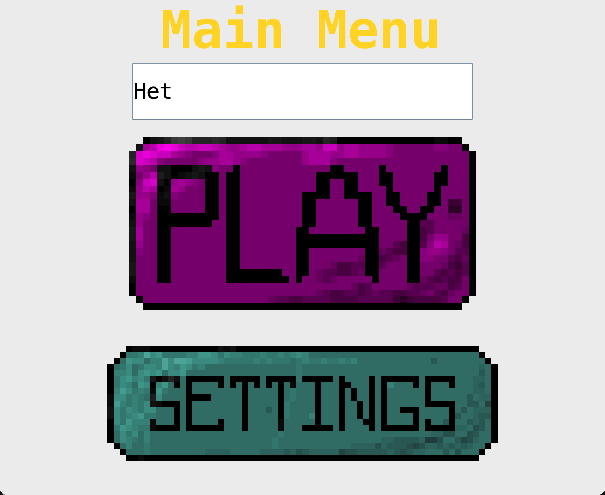
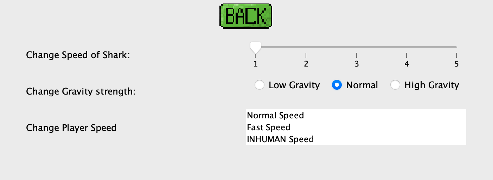

# 🌊 Ocean Odyssey - Underwater Platformer

This was one of my first looks into programming. Here we made a very simple platformer game made entirely in java uning Java Swing. It contains the key componenets like a player, a monitoring enemy, platforms (ofc), and and end goal of reaching the anchor. It's nothing fancy but we had a blast making it. We got to learn about sprite animation, game physics and a lot more. My favorite part was that I got to draw the ocean character and all his different frames.


## 🎮 Game Features

- **Dynamic Player Movement**: Smooth controls with arrow keys and spacebar for jumping
- **Dumb Enemies**: Sharks that patrol in a defined path
- **Multiple Game States**: Menu, Playing, Settings, Game Over, and Win screens
- **Customizable Settings**: Adjust enemy speed, gravity, and player speed
- **Collision Detection**: Precise physics system for platform interactions
- **Beautiful Graphics**: Custom sprite animations and underwater visuals (best in the industry)

## 🎯 How to Play

- **Arrow Keys**: Move left/right
- **Spacebar**: Jump
- **Objective**: Reach the anchor while avoiding sharks
- **Settings**: Customize game difficulty and physics

## 🚀 Quick Start

### Prerequisites

- Java 11 or higher (recommended: Java 17)
- Git

### Installation & Running

1. **Clone the repository**

   ```bash
   git clone https://github.com/yourusername/Ocean_Odyssey.git
   cd Ocean_Odyssey
   ```

2. **Compile and Run (macOS/Linux)**

   ```bash
   chmod +x compile_and_run.sh
   ./compile_and_run.sh
   ```

3. **Compile and Run (Windows)**

   ```cmd
   compile_and_run.bat
   ```

4. **Manual Compilation**
   ```bash
   mkdir -p bin
   javac -d bin -cp "src" src/main/MainClass.java src/main/Game.java src/main/GamePanel.java src/main/GameWindow.java src/main/MenuFrame.java src/main/Settings.java src/Entities/*.java src/gamestates/*.java src/inputs/*.java src/Levels/*.java src/Physics/*.java src/utilz/*.java
   java -cp "bin:res" main.MainClass
   ```

## 📁 Project Structure

```
Ocean_Odyssey/
├── res/                      # Game assets (images, sprites)
│   ├── background.png
│   ├── diverSpriteAtlas.png
│   ├── enemySpriteAtlas.png
│   ├── platformAtlas.png
│   └── ...
├── src/
│   ├── Entities/             # Game objects (Player, Enemy, Anchor, Platforms)
│   ├── Gamestates/           # Game state management (Menu, Playing, etc.)
│   ├── Inputs/               # Input handling (Keyboard, Mouse)
│   ├── Levels/               # Level design and management
│   ├── Main/                 # Core game engine (Game loop, Window, Panel)
│   ├── Physics/              # Collision detection system
│   └── Utilz/                # Utilities (Constants, Asset loading)
├── compile_and_run.sh        # Unix/Linux run script
├── compile_and_run.bat       # Windows run script
└── README.md
```

## 🎨 Key Components

- **`src/Entities/`**: Contains code for platforms, player, moving enemy, and the anchor
- **`src/Levels/`**: Contains level information with platform placement
- **`src/Physics/`**: Contains the collision detection system
- **`src/Gamestates/`**: Manages different game states (pause, settings, playing, game over)
- **`src/Inputs/`**: Handles all input listeners (mouse and keyboard)
- **`src/Main/`**: Foundation code including main method, game panel, and window
- **`src/Utilz/`**: Constants, animation data, and asset loading methods

## 🛠️ Technical Details

- **Language**: Java
- **Graphics**: Java Swing
- **Architecture**: Object-oriented with state pattern
- **Game Loop**: Custom implementation with FPS/UPS control
- **Input System**: Event-driven keyboard and mouse handling (future update maybe...)
- **Physics**: Custom collision detection and gravity system

## 🎮 Game Controls

| Action          | Key      |
| --------------- | -------- |
| Move Left       | ← Arrow  |
| Move Right      | → Arrow  |
| Jump            | Spacebar |
| Menu Navigation | Mouse    |

## 🔧 Customization

The game includes a settings menu where you can adjust:

- **Enemy Speed**: 1-5 (affects shark movement speed)
- **Gravity**: Low, Normal, High (affects jump physics)
- **Player Speed**: Normal, Fast, INHUMANE (affects movement speed)

## 📸 Screenshots





## 🤝 Contributing

This is a personal project, but feel free to fork and experiment with the code!

## 📄 License

This project is open source and available under the [MIT License](LICENSE).

## 🙏 Acknowledgments

- Built as a learning project for Java game development
- Custom sprite work and game design
- Inspired by classic platformer games

---

**Enjoy diving into Ocean Odyssey! 🌊🐠**
